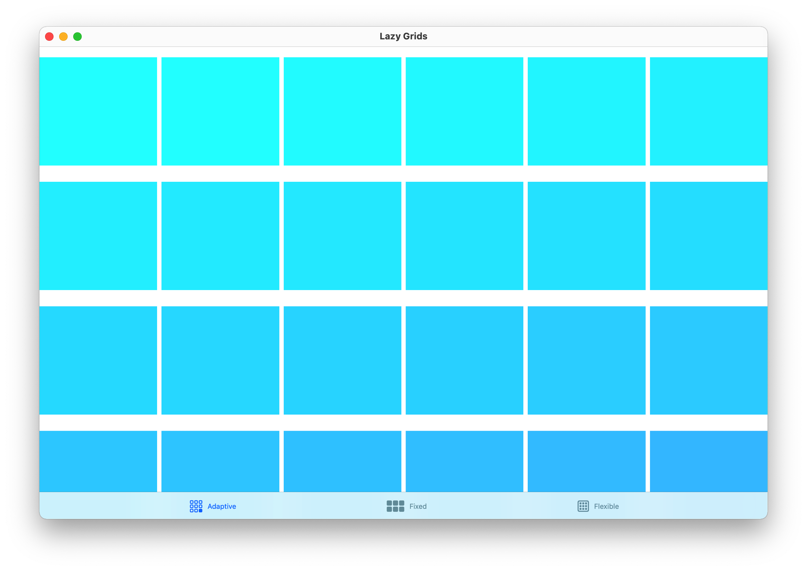

#  Lazy Grids

This project is built to explore different properties of the `LazyHGrid` and `LazyVGrid`. Change the team in project settings and the target to an Apple Silicon Mac or an iPad. When running, resize the app window and see how different grids are responding. 
